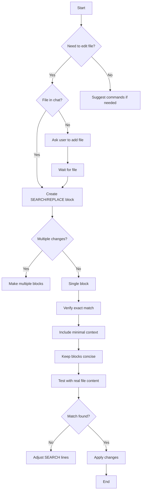

# SEARCH/REPLACE Block Workflow

## Key Rules
1. Always verify exact line matches including whitespace
2. One block per logical change
3. Never include unchanged lines in blocks
4. Use shell commands for file operations
5. New files get empty SEARCH section
